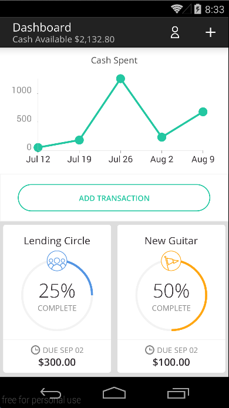
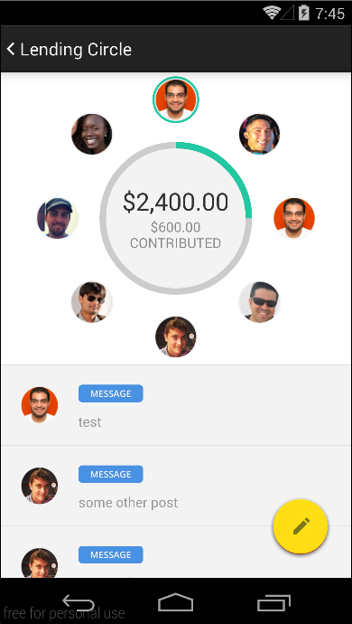

# Goalie (Android)
Goalie is a mobile application that enables [Mission Asset Fund](http://missionassetfund.org/) (MAF) [Lending Circle](http://missionassetfund.org/lending-circles/) participants to: 

- Easily monitor their loan status, including payments in real-time.
- Monitor and input savings and spendings.
- Create short-term budget goals.
- Receive notifications from MAF staff if there are any payment issues or program updates.

## Walkthrough


### Screenshots


&nbsp;&nbsp;

&nbsp;&nbsp;

&nbsp;&nbsp;

&nbsp;&nbsp;

&nbsp;&nbsp;

&nbsp;&nbsp;

&nbsp;&nbsp;

&nbsp;&nbsp;


## Team

**Devs**
- Amit Bharadwaj ([@amitbharadwaj](http://github.com/amitbharadwaj))
- Felipe Duarte ([@fcduarte](http://github.com/fcduarte))
- Jose Montes de Oca ([@josemontesdeoca](http://github.com/josemontesdeoca))

**Designers**
- Jairo Avalos ([@jairoavalos](http://github.com/jairoavalos))
- Tom Gurka ([@tomgurka](http://github.com/tomgurka))

## Setup Instructions
* **Clone the repository**

`git clone https://github.com/CodePath-MAF/AndroidClient.git`

* **Create the config file**

Create `res/values/app_config.xml` and add in the Parse Application & Client ID for the project following this sample:

```xml
<?xml version="1.0" encoding="utf-8"?>
<resources>
    <string name="parseApplicationId">PARSE_APPLICATION_ID</string>
    <string name="parseClientId">PARSE_CLIENT_ID</string>
</resources>
```

**Note:** This config file will be gitginore.

* **Import Third-party Libraries**

Libraries are included within the `third-party-libs` folder.

## Third-party Libraries

Below we have the list of third-party libraries used on the app:

- [Parse SDK](https://parse.com/docs/android_guide): responsible for doing the data synchronization between the app and remote server
- [ParseLoginUI](https://github.com/ParsePlatform/ParseUI-Android): UI wrapper for log in/sign up services
- [HoloGraphLibrary](https://bitbucket.org/danielnadeau/holographlibrary/wiki/Home): allow beautiful graphs and charts to be easily incorporated into Android
- [Calligraphy](https://github.com/chrisjenx/Calligraphy): custom fonts for Android
- [Android ViewPagerIndicator](https://github.com/JakeWharton/Android-ViewPagerIndicator): Paging indicator widgets
- [CircularView](https://github.com/sababado/CircularView): A custom view for Android. It consists of a larger center circular view that is surrounded by other circles which may represent data
- [FloatingActionButton](https://github.com/FaizMalkani/FloatingActionButton): Library to use the Floating Action Button (FAB) from Android L on Jellybean and KitKat
- [TwoWay-View](https://github.com/lucasr/twoway-view): An AdapterView with support for vertical and horizontal scrolling
- [Circular ProgressBar](https://github.com/ylyc/circular_progress_bar): A simple subclass of android.widget.ProgressBar that contains title and subtitile in the center

## License

All code is distributed under MIT license. See LICENSE file for more information.

## Contributing

Please fork this repository and contribute back using [pull requests](https://github.com/CodePath-MAF/AndroidClient/pulls).

Any contributions, large or small, major features, bug fixes, additional language translations, unit/integration tests are welcomed and appreciated but will be thoroughly reviewed and discussed.
